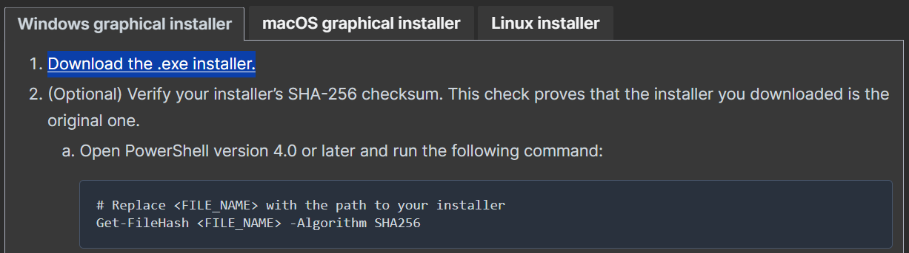
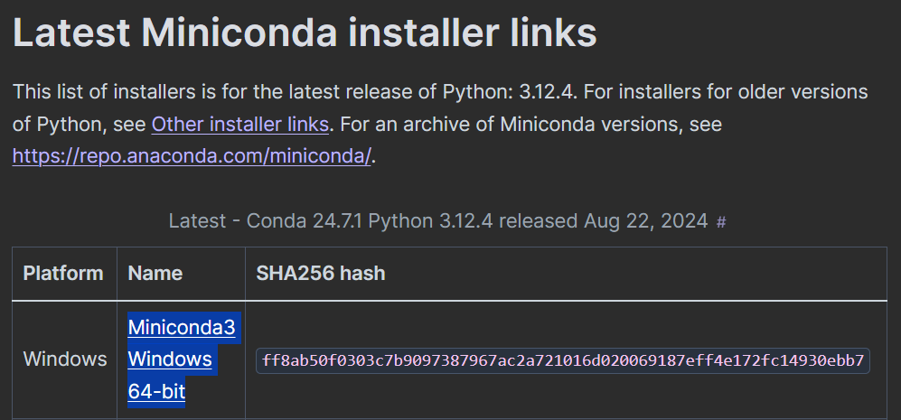
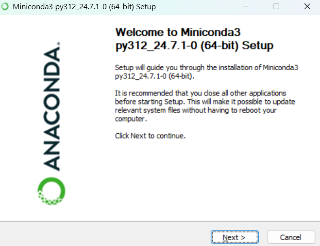
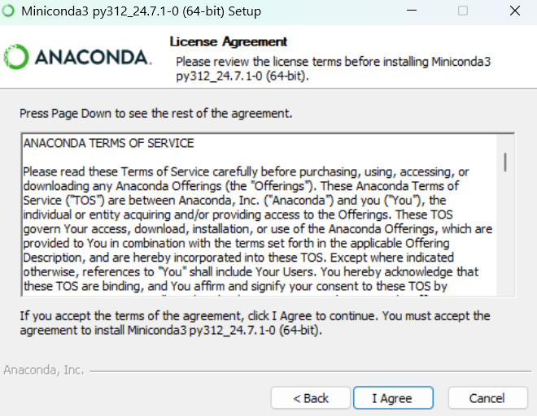
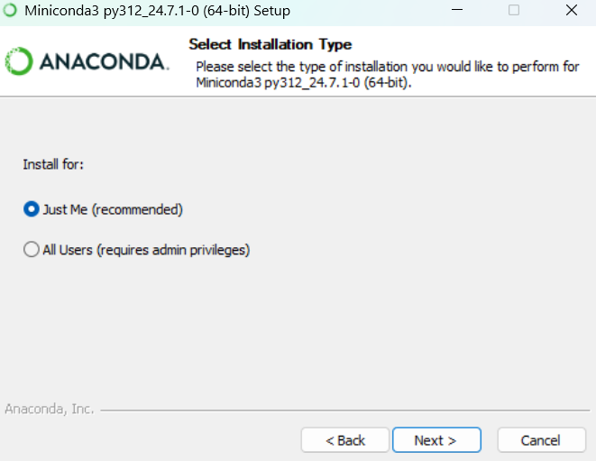
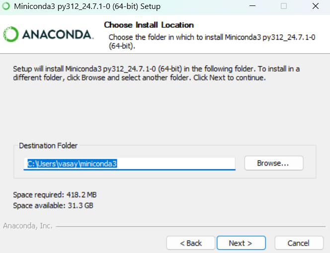
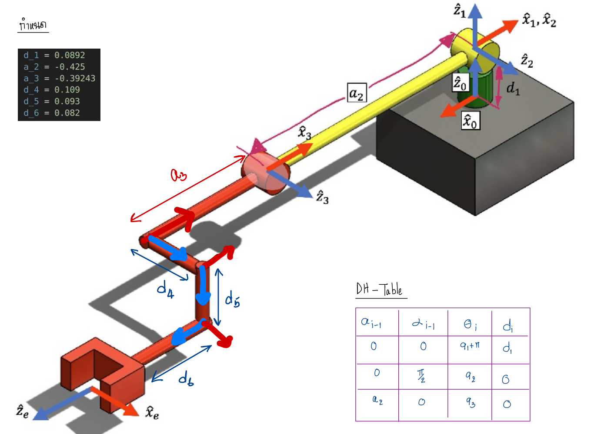

# HW3 Robotics: Jacobian and Singularity Analysis

This project contains Python functions to calculate the Jacobian matrix of a robot's end-effector, check for singularities, and compute the required joint torques for a given wrench applied to the end-effector. The code relies on a provided utility function `FKHW3` for forward kinematics and uses **Robotics Toolbox for Python** for validation.

## Team Members
1. Poppeth Pethchamli
2. Vasayos Tosiri

## Prerequisites

Ensure you have the following installed:
- Python 3.x
- `numpy` library for matrix operations
- `math` module for handling pi and other mathematical operations
- `roboticstoolbox-python` for validating the results
- `spatialmath-python` for transformations

### Files Provided
- `HW3_utils.py`: Contains the `FKHW3` function for calculating forward kinematics. This file must be in the same directory as the script.
- `FRA333_HW3_41_51.py`: Contains the main functions for calculating the Jacobian, checking for singularities, and computing joint efforts.
- `testScript.py`: Script to verify the correctness of the main functions using Robotics Toolbox for Python.
- `singularity_finder.py`: A script that detects singular configurations of a 3-degree-of-freedom (3DOF) robot.

### Our Robot

  

This is our Robot MDH parameters.
- **d_1** = 0.0892 

- **a_2** = 0.425

```bash
DHRobot: 3DOF_Robot, 3 joints (RRR), dynamics, modified DH parameters

                                ┌────────┬───────┬────────────┬──────┐
                                │  aⱼ₋₁  │ ⍺ⱼ₋₁  │     θⱼ     │  dⱼ  │
                                ├────────┼───────┼────────────┼──────┤
                                │   0.0  │  0.0° │  q1 + 180° │  d_1 │
                                │   0.0  │ 90.0° │         q2 │  0.0 │
                                │  -a_2  │  0.0° │         q3 │  0.0 │
                                └────────┴───────┴────────────┴──────┘
```

### Functions Overview

1. **`endEffectorJacobianHW3(q: list[float]) -> list[float]`**

    - **Input**: 
        - `q`: A list of joint angles representing the robot's configuration.
    - **Output**: 
        - Returns a 6xN Jacobian matrix, where the first three rows represent the linear velocity and the last three rows represent the angular velocity of the end-effector.
    
    - **Description**: 
        - This function calculates the Jacobian matrix for the robot based on its current configuration. It uses the forward kinematics results to compute the linear and angular velocity components.

    - **Jacobian Formula**:

2. **`checkSingularityHW3(q: list[float]) -> bool`**

    - **Input**: 
        - `q`: A list of joint angles representing the robot's configuration.
    - **Output**: 
        - Returns `True` if the robot is in a singularity configuration, otherwise `False`.
    
    - **Description**: 
        - This function checks if the robot's current configuration is at or near a singularity by computing the determinant of the Jacobian's translational component.

    - **Singularity Calculation**:

        To find singularities in a robot's motion using the Jacobian, we use this following relationship.

        <h3 align="center">
          || det (J<sup>*</sup>(q)) || &lt; &epsilon;
        </h3>
        
        Where:
        - $J^*$ is the **Jacobian** matrix of the robot that already **reduce**.
        - $q$ is the list of joint angles representing the robot's configuration.
        - $\epsilon$ is the **small threshold value** that helps determine whether the robot is in or near a singular configuration.

3. **`computeEffortHW3(q: list[float], w: list[float]) -> list[float]`**

    - **Input**: 
        - `q`: A list of joint angles representing the robot's configuration.
        - `w`: A list of 6 elements representing the wrench (forces and torques) applied at the end-effector.
    - **Output**: 
        - Returns a list of joint torques required to resist the applied wrench.
    
    - **Description**: 
        - This function computes the joint torques needed to resist a given wrench applied to the end-effector using the transpose of the Jacobian matrix.  

    - **Effort Calculation**:

        To compute the effort (joint torques or forces) for a 3 DOF robot using the Jacobian, we use this following relationship.

        <h3 align="center">
          &tau; = J^T &times; w
        </h3>

        Where:
        - $\tau$ is the vector of joint torques (effort).
        - $J$ is the **Jacobian** matrix of the robot.
        - $w$ is the **wrench** (forces and torques) applied at the end-effector.

### Sample Usage

```python
from FRA333_HW3_41_51 import endEffectorJacobianHW3, checkSingularityHW3, computeEffortHW3
from math import pi

import numpy as np

# Define initial joint configuration and wrench
q_initial = np.array([0.0, 0.0, 0.0])
w_initial = np.array([0.0, 0.0, 0.0, 0.0, 0.0, 0.0])  # No force or torque applied

# Calculate the Jacobian at the initial configuration
print("--------------------<Jacobian>--------------------")
print(endEffectorJacobianHW3(q_initial))

# Check if the robot is at a singularity
q_singularity = np.array([0.0, pi/6, 3.13])

print("--------------------<Singularity>--------------------")
print(checkSingularityHW3(q_singularity))

# Compute the joint torques for the given wrench
print("--------------------<Zero Effort>--------------------")
print(computeEffortHW3(q_initial, w_initial)) #return [0.0, 0.0, 0.0]

w = np.array([0.0, 0.0, 10.0, 0.0, 0.0, 0.0]) #with force

print("--------------------<with Effort>--------------------")
print(computeEffortHW3(q_initial, w))
```

### Validation Script

The provided `testScript.py` verifies the correctness of the manually calculated Jacobian, singularity check, and effort computation using **Robotics Toolbox for Python**.

### Setup Environment for **Robotics Toolbox**

**`For windows`**:

1. Download [Miniconda](https://docs.anaconda.com/miniconda/miniconda-install/) 




2. Install [Miniconda](https://docs.anaconda.com/miniconda/miniconda-install/)






3. Run Anaconda Prompt(miniconda3)


4. If you install correctly it will show **(base)** infront of your user

    ```bash
    (base) C:\Users\vasay>
    ```

5. Make sure your environment use **python 3.8+** by using this command.

    ```bash
    python -V
    ```
6. Install & upgrade **python-pip**.
    ```bash
    python -m pip install --upgrade pip
    pip3 install -U pip
    ```
    Make sure pip is installed using `pip3 -V`

7. Install ```Robotics Toolbox for Python``` using pip3. Tutorial from [**Robotics Toolbox GitHub**](https://github.com/petercorke/robotics-toolbox-python).
    ```bash
    pip3 install roboticstoolbox-python
    ```
    After finished install make sure you installed **roboticstoolbox-python** successfully using
    ```bash
    pip3 show roboticstoolbox-python
    ```  
    For use ```Robotics Toolbox for Python``` have to use **numpy < 1.27.0**
    ```bash
    pip3 install numpy==1.26.4
    ```
    Make sure you using **numpy < 1.27.0** by
    ```bash
    pip3 show numpy
    ```
    Check that **roboticstoolbox-python** can use with python environment.
    ```sh
    (base) C:\Users\vasay>python
    Python 3.12.3 | packaged by conda-forge | (main, Apr 15 2024, 18:20:11) [MSC v.1938 64 bit (AMD64)] on win32
    Type "help", "copyright", "credits" or "license" for more information.
    >>> import numpy as np
    >>> np.__version__
    '1.26.4'
    >>> import spatialmath as stm
    >>> stm.__version__
    '1.1.11'
    >>> import roboticstoolbox as rtb
    >>> rtb.__version__
    '1.1.1'
    >>> print(rtb.models.Panda())
    ERobot: panda (by Franka Emika), 7 joints (RRRRRRR), 1 gripper, geometry, collision
    |   link   |     link     |   joint   |    parent   |              ETS: parent to link               |
    |:--------:|:------------:|:---------:|:-----------:|:----------------------------------------------:|
    |     0    |  panda_link0 |           |     BASE    | SE3()                                          |
    |     1    |  panda_link1 |     0     | panda_link0 | SE3(0, 0, 0.333) ⊕ Rz(q0)                      |
    |     2    |  panda_link2 |     1     | panda_link1 | SE3(-90°, -0°, 0°) ⊕ Rz(q1)                    |
    |     3    |  panda_link3 |     2     | panda_link2 | SE3(0, -0.316, 0; 90°, -0°, 0°) ⊕ Rz(q2)       |
    |     4    |  panda_link4 |     3     | panda_link3 | SE3(0.0825, 0, 0; 90°, -0°, 0°) ⊕ Rz(q3)       |
    |     5    |  panda_link5 |     4     | panda_link4 | SE3(-0.0825, 0.384, 0; -90°, -0°, 0°) ⊕ Rz(q4) |
    |     6    |  panda_link6 |     5     | panda_link5 | SE3(90°, -0°, 0°) ⊕ Rz(q5)                     |
    |     7    |  panda_link7 |     6     | panda_link6 | SE3(0.088, 0, 0; 90°, -0°, 0°) ⊕ Rz(q6)        |
    |     8    | @panda_link8 |           | panda_link7 | SE3(0, 0, 0.107)                               |
    >>> 
    [2]+  Stopped                 python3
    ```
    If you see a table, so now your **roboticstoolbox-python** library is ready now.

**`For ubuntu`**:

1. Make sure your environment use **python 3.8+** by using this command.

    ```bash
    python3 -V
    ```
2. Install & upgrade **python3-pip**.
    ```bash
    sudo apt-get install python3-pip
    python3 -m pip install --upgrade pip
    pip3 install -U pip
    ```
    Make sure pip is installed using `pip3 -V`

3. Install ```Robotics Toolbox for Python``` using pip3. Tutorial from [**Robotics Toolbox GitHub**](https://github.com/petercorke/robotics-toolbox-python).
    ```bash
    pip3 install roboticstoolbox-python
    ```
    After finished install make sure you installed **roboticstoolbox-python** successfully using
    ```bash
    pip3 show roboticstoolbox-python
    ```  
    For use ```Robotics Toolbox for Python``` have to use **numpy < 1.25.0**
    ```bash
    pip3 install numpy==1.24.4
    ```
    Make sure you using **numpy < 1.25.0** by
    ```bash
    pip3 show numpy
    ```
    Check that **roboticstoolbox-python** can use with python environment.
    ```sh
    teety@TeeTy-Ubuntu:~$ python3
    Python 3.10.12 (main, Sep 11 2024, 15:47:36) [GCC 11.4.0] on linux
    Type "help", "copyright", "credits" or "license" for more information.
    >>> import numpy as np
    >>> np.__version__
    '1.24.4'
    >>> import spatialmath as stm
    >>> stm.__version__
    '1.1.11'
    >>> import roboticstoolbox as rtb
    >>> rtb.__version__
    '1.1.0'
    >>> print(rtb.models.Panda())
    ERobot: panda (by Franka Emika), 7 joints (RRRRRRR), 1 gripper, geometry, collision
    |   link   |     link     |   joint   |    parent   |              ETS: parent to link               |
    |:--------:|:------------:|:---------:|:-----------:|:----------------------------------------------:|
    |     0    |  panda_link0 |           |     BASE    | SE3()                                          |
    |     1    |  panda_link1 |     0     | panda_link0 | SE3(0, 0, 0.333) ⊕ Rz(q0)                      |
    |     2    |  panda_link2 |     1     | panda_link1 | SE3(-90°, -0°, 0°) ⊕ Rz(q1)                    |
    |     3    |  panda_link3 |     2     | panda_link2 | SE3(0, -0.316, 0; 90°, -0°, 0°) ⊕ Rz(q2)       |
    |     4    |  panda_link4 |     3     | panda_link3 | SE3(0.0825, 0, 0; 90°, -0°, 0°) ⊕ Rz(q3)       |
    |     5    |  panda_link5 |     4     | panda_link4 | SE3(-0.0825, 0.384, 0; -90°, -0°, 0°) ⊕ Rz(q4) |
    |     6    |  panda_link6 |     5     | panda_link5 | SE3(90°, -0°, 0°) ⊕ Rz(q5)                     |
    |     7    |  panda_link7 |     6     | panda_link6 | SE3(0.088, 0, 0; 90°, -0°, 0°) ⊕ Rz(q6)        |
    |     8    | @panda_link8 |           | panda_link7 | SE3(0, 0, 0.107)                               |
    >>> 
    [2]+  Stopped                 python3
    ```
    If you see a table, so now your **roboticstoolbox-python** library is ready now.

### Robot's MDH Parameters Define for **Robotics Toolbox**



```python
#This parameters from HW3_utils.py file.
d_1 = 0.0892
a_2 = 0.425
a_3 = 0.39243
d_4 = 0.109
d_5 = 0.093
d_6 = 0.082

robot = rtb.DHRobot(
    [
        rtb.RevoluteMDH(alpha = 0.0     ,a = 0.0      ,d = d_1    ,offset = pi ),
        rtb.RevoluteMDH(alpha = pi/2    ,a = 0.0      ,d = 0.0    ,offset = 0.0),
        rtb.RevoluteMDH(alpha = 0.0     ,a = -a_2     ,d = 0.0    ,offset = 0.0),
    ],
    tool = SE3([
    [0, 0, -1, -(a_3 + d_6)],
    [0, 1, 0, -d_5],
    [1, 0, 0, d_4],
    [0, 0, 0, 1]]),
    name = "3DOF_Robot"
    )
```

### Validation Functions

1. **`CheckJacobian(q: list[float]) -> list[float]`**

    - **Input**: 
        - `q`: A list of joint angles representing the robot's configuration.
    - **Output**: 
        - Returns a 6xN Jacobian end-effector matrix from **robotics toolbox**.

    - **Description**: 
        - Uses Robotics Toolbox to calculate the Jacobian matrix for comparison with the manually computed Jacobian.
    
2. **`CheckSingularity(q: list[float]) -> bool`**

    - **Input**: 
        - `q`: A list of joint angles representing the robot's configuration.
    - **Output**: 
        - Returns `True` if the robot is in a singularity configuration, otherwise `False`.

    - **Description**: 
        - Uses the Jacobian determinant to check for singularities and compares it with the result from the manual method.

3. **`CheackEffort(q: list[float], w: list[float]) -> list[float]`**

    - **Input**: 
        - `q`: A list of joint angles representing the robot's configuration.
        - `w`: A list of 6 elements representing the wrench (forces and torques) applied at the end-effector.
    - **Output**: 
        - Returns a list of joint torques required to resist the applied wrench from both two methods.

    - **Description**: 

        Computes the joint torques based on a given wrench using two methods:

        - Using the `robot.pay()` method from Robotics Toolbox.
        - Using the formula `τ = JT ⋅ w` for comparison with the manual method.
